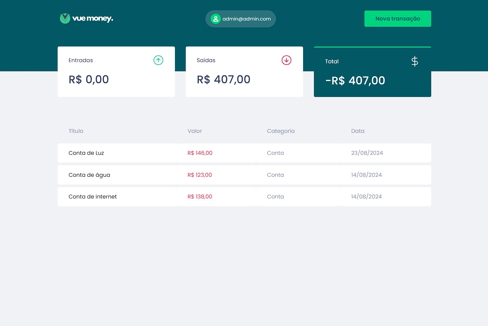

<h1 align="center">
  
</h1>

  
  

 

## 🚀 Deploy

Acesse essa aplicação online [aqui](https://vue-money-nu.vercel.app/)

Usuário para teste: 
- usuario: admin@admin.com
- senha: password

## 🚀 Tecnologias

Esse projeto foi desenvolvido com as seguintes tecnologias:

- Vue.js
- TypeScript
- Pinia
- Firebase

## 💻 Projeto

Gerenciador financeiro com entrada de saída de contas e transações.💰

## 🔖 Layout

Você pode visualizar o layout do projeto através [desse link](https://www.figma.com/file/0xmu9mj2TJYoIOubBFWsk5/dtmoney-Ignite-(Copy)?node-id=0%3A1). É necessário ter conta no [Figma](https://figma.com) para acessá-lo.

---

Desenvolvido por [Renato Khael](https://renatokhael.dev)
